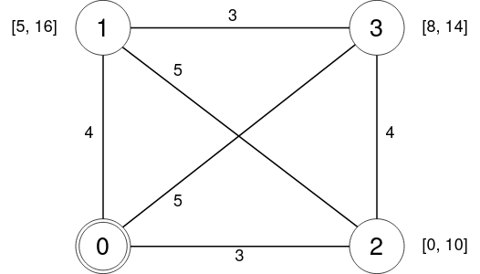

Tutorial
========

Let's learn DIDPPy using the traveling salesperson problem with time windows (TSPTW) as an example.

TSPTW
-----

In TSPTW, we are given a set of locations :math:`N = \{ 0, ..., n-1 \}`.
The salesperson starts from the depot :math:`0`, visit each customer :math:`i \in \{ 1, ..., n-1 \}` exactly once, and returns to the depot.
The traveling time from :math:`i` to :math:`j` is :math:`c_{ij}`.
Each customer :math:`i` must be visited within time window :math:`[a_i, b_i]`, and the salesperson must wait until :math:`a_i` if arriving at :math:`i` before :math:`a_i`.
The objective is to minimize the total travel time (not including the waiting time).

The following image is an exmaple of TSPTW with four locations.

DP Model for TSPTW
------------------

In DP, using recurisve equations, we decopose the problem into subproblems and describe the optimal value of the original problem using the values of the subproblems.
Each problem is defined as a *state*, which is a tuple of variables that describe the problem.
The value function :math:`V` maps a state to the optimal value of the problem.

In TSPTW, think about visiting customers one by one.
If the salesperson visits :math:`j` from the depot, the problem is reduced to visiting customers :math:`N \setminus \{ 0, j \}` from location :math:`j` at time :math:`\max \{ c_{0j}, a_j \}`.
Therefore, we can define a subproblem using the folowing three variables:

* :math:`U \subseteq N` : the set of unvisited customers.
* :math:`i \in N` : the current location.
* :math:`t` : the current time.

In genral, when customer :math:`j \in U` is visited from location :math:`i` at time :math:`t`, the problem is reduced to visiting customers :math:`U \setminus \{ j \}` from location :math:`j` at time :math:`\max \{ t + c_{ij}, a_j \}`.
To visit customer :math:`j`, the salesperson must arrive before :math:`b_j`, i.e., :math:`t + c_{ij} \leq b_j`.
When all customers are visited, the salesperson must return to the depot from location :math:`i`.
Overall, we get the following DP model:

.. math::
   \text{compute } & V(N \setminus \{ 0 \}, 0, 0) \\ 
   & V(U, i, t) = \begin{cases}
        \min\limits_{j \in U: t + c_{ij} \leq b_j} c_{ij} + V(U \setminus \{ j \}, j, \max \{ t + c_{ij}, a_j \})  & \text{if } U \neq \emptyset \\
        c_{i0} + V(U, 0, t + c_{i0}) & \text{if } U = \emptyset \land i \neq 0 \\
        0 & \text{if } U = \emptyset \land i = 0.
   \end{cases}

Modeling in DIDPPy
------------------

Now, let's code the above DP model using DIDPPy.
Assume that the data is given.
First, start with importing DIDPPy and creating the model.

.. code-block:: python

   import didppy as dp

   n = 4
   a = [0, 5, 0, 8]
   b = [100, 16, 10, 14]
   c = [
       [0, 3, 4, 5],
       [3, 0, 5, 4],
       [4, 5, 0, 3],
       [5, 4, 3, 0],
   ]
   
   model = dp.Model(maximize=False, float_cost=False)

Because the objective is to minimize the total travel time, we set `maximize=False`.
We assume that the travel time is integer, so we set `float_cost=False`.
Actually, `maximize=False` and `float_cost=False` are the default values, so we can omit them.

Object Types
~~~~~~~~~~~~

First, we define an *object type*, which reporesents the type of objects that are used in the model.
In TSPTW, customers are objects with the same object type.

.. code-block:: python

   customer = model.add_object_type(number=n)

Object types are required to define set and element variables, as explained later.

State Variables
~~~~~~~~~~~~~~~

A state of a problem is defined by *state variables*.
There are four types of state varibales:

* Set variable (:class:`~didppy.SetVar`) : a set of objects.
* Element variable (:class:`~didppy.ElementVar`) : an object.
* Int variable (:class:`~didppy.IntVar`) : an integer.
* Float variable (:class:`~didppy.FloatVar`) : a continuous value.

In TSPTW, :math:`U` is a set variable , :math:`i` is an element variable, and :math:`t` is an int variable.

.. code-block:: python

   # U
   unvisited = model.add_set_variable(object_type=customer, target=list(range(1, n)))
   # i
   location = model.add_element_variable(object_type=customer, target=0)
   # t
   time = model.add_int_variable(target=0)

While :math:`i` is integer, we define it as an element variable as it represents an element in the set :math:`N`.
There are some practical differences between element and int variables:

* Element variables are nonnegative.
* Element variables can be used to describe changes and conditions on a set variable.
* Element variables can be used to access a value of a table (explained later).

While we use the integer cost and an integer variable for :math:`t`, we can use the float cost and a float variable for :math:`t` by using :func:`~didppy.Model.add_float_var` if we want to use continuous travel time.

State variables are defined with their *target values*.
The objective of the DP model is to compute the value of the state with the target values, i.e., :math:`U = N \setminus \{ 0 \}`, :math:`i = 0`, and :math:`t = 0`.

Tables of Constants
~~~~~~~~~~~~~~~~~~~

In TSPTW, :math:`a_i`, :math:`b_i`, and :math:`c_{ij}` are constants depending on customers.
In DIDPPy, such constants are defined as *tables*.
Similarly to state variables, tables have types:

* Set table (:class:`~didppy.SetTable`) : a table containing sets of objects.
* Element table (:class:`~didppy.ElementTable`) : a table containining objects.
* Int table (:class:`~didppy.IntTable`) : a table containing integers.
* Float table (:class:`~didppy.FloatTable`) : a table containing continuous values.
* Bool table (:class:`~didppy.BoolTable`) : a table containing boolean values (`True` or `False`).

In the case of TSPTW, :math:`a_i` and :math:`b_i`, and :math:`c_{ij}` are int tables.

.. code-block:: python

   ready_time = model.add_int_table(a)
   due_date = model.add_int_table(b)
   travel_time = model.add_int_table(c)

By passing a nested list of `int` to :func:`~didppy.Model.add_int_table`, we can create up to a three-dimensional int table.
For tables more than three-dimensional, we can pass a `dict` with the default value.
See :func:`~didppy.Model.add_int_table` for more details.

In the case of a set table, we can pass a list (or a dict) of `list` or `set` with specifying the object type.
See :func:`~didppy.Model.add_set_table` and other examples such as :doc:`SALBP-1 <examples/salbp-1>` for more details.

The benefit of defining a table is that we can access its value by using a state variable in indices, as explained later.

Transitions
~~~~~~~~~~~

The reucursive equation of the DP model is defined by *transitions*.
A transition transforms the state in the left-hand side into the state in the right-hand side.

In TSPTW, we have the following recursive equation:

.. math::
    V(U, i, t ) = \min\limits_{j \in U: t + c_{ij} \leq b_j} c_{ij} + V(U \setminus \{ j \}, j, \max \{ t + c_{ij}, a_j \})  \text{ if } U \neq \emptyset.

In DIDPPy, it is represented as follows:

.. code-block:: python

    for j in range(1, n):
        visit = dp.Transition(
            name="visit {}".format(j),
            cost=travel_time[location, j] + dp.IntExpr.state_cost(),
            preconditions=[unvisited.contains(j), time + travel_time[location, j] <= due_date[j]],
            effects=[
                (unvisited, unvisited.remove(j)),
                (location, j),
                (time, dp.max(time + travel_time[location, j], ready_time[j]))
            ],
        )
        model.add_transition(visit)

:code:`cost` defines how the value of the left-hand side state, :math:`V(U, i, t)`,  is computed based on the value of the right-hand side state, :math:`V(U \setminus \{ j \}, j, \max\{ t + c_{ij}, a_j \})`, represented by :func:`didppy.IntExpr.state_cost`.
In the case of the continuous cost, we can use :func:`didppy.FloatExpr.state_cost`.

:code:`travel_time[location, j]` corresponds to :math:`c_{ij}`.
Here, state variable :code:`location` is used in the index, which is why we needed to register nested list :code:`c` to the model as table :code:`travel_time`.
Note that :code:`travel_time[location, j]` must be used instead of :code:`travel_time[location][j]`.

:code:`preconditions` make sure that the transition is considered only when :math:`j \in U` (:code:`unvisited.contains(j)`) and :math:`t + c_{ij} \leq b_j` (:python:`time + travel_time[location, j] <= due_dae[j]`).

We define a transition for each :math:`j \in N \setminus \{ 0 \}`, and then filter customers that do not satisfy :math:`j \in U` and :math:`t + c_{ij} \leq b_j` by using :code:`preconditions`.

Effects are described by a list of tuples of a state variable and its updated value described by an expression.

* :math:`U \setminus \{ j \}` : :code:`unvisited.remove(j)` (:class:`~didppy.SetExpr`).
* :math:`j` : :code:`j` (automatically converted to :class:`~didppy.ElementExpr`).
* :math:`\max\{ t + c_{ij}, a_j \}` : :code:`dp.max(time + travel_time[location, j], ready_time[j])` (:class:`~didppy.IntExpr`).

We use :func:`didppy.max` instead of built-in :code:`max` to take the maximum of two :class:`~didppy.IntExpr`.
As in this example, some built-in functions are replaced by :ref:`functions in DIDPPy <reference:Functions>` to support expressions.
However, we can apply built-in :code:`sum`, :code:`abs`, and :code:`pow` to :class:`~didppy.IntVar`, :class:`~didppy.IntExpr`, :class:`~didppy.FloatVar`, and :class:`~didppy.FloatExpr` as well as operators such as :code:`+`, :code:`-`, :code:`*`, and :code:`/`.
:class:`~didppy.SetVar` and :class:`~didppy.SetExpr` have a similar interface as :code:`set` in Python.

Preconditions are described by list of *conditions*, expressions whose returing value is boolean.
:code:`unvisited.contains(j)` is a condition that checks if :code:`j` is contained in the state variable :code:`unvisited`.
The second condition using a comparison operator :code:`<=` to compare two expressions.

The equation

.. math::
    V(U, i, t) = c_{i0} + V(U, 0, t + c_{i0}) \text{ if } U = \emptyset \land i \neq 0

is defined by another transition in a similar way.

.. code-block:: python

    return_to_depot = dp.Transition(
        name="return",
        cost=travel_time[location, 0] + state_cost,
        effects=[
            (location, 0),
            (time, time + travel_time[location, 0]),
        ],
        preconditions=[unvisited.is_empty(), location != 0]
    )
    model.add_transition(return_to_depot)

Once a transition is created, it is registed to a model by :func:`~didppy.Model.add_transition`.
We can define a *forced transition*, by using :code:`forced=True` in this function while it is not used in TSPTW.
A forced transition is useful to break symmetry in the DP model.
See other examples such as :doc:`Talent Scheduling <examples/talent-scheduling>` for more details.

Base Cases
~~~~~~~~~~

A *base cases* is a set of conditions to terminate the recursion.
In our DP model,

.. math::
    V(U, i, t) = 0 \text{ if } U = \emptyset \land i = 0

is a base case.
It is defined as follows in DIDPPy.

.. code-block:: python

    model.add_base_case([unvisited.is_empty(), location == 0])

